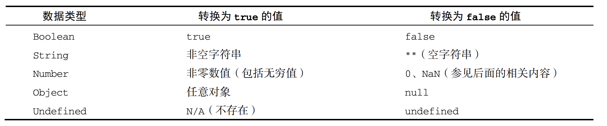

# Javascript 高级程序设计（第 4 版）阅读笔记

## 概览

Javascrtip

- ECMAScript
- DOM
- BOM


## HTML 中的 Javascript

### `<script>` 元素的属性

- async：异步加载脚本，在脚本可用时执行，在脚本加载时不阻塞页面渲染
- charset
- crossorigin
- defer：表示脚本可以延迟到文档完全解析和显示之后再执行。（立即下载但是延迟执行）
- intergrity：允许比对接收到的资源和指定的加密签名以验证子资源完整性（SRI， Subresource Integrity）。如果接收到的资源的签名与这个属性指定的签名不匹配，则页面会报错， 脚本不会执行。这个属性可以用于确保内容分发网络（CDN，Content Delivery Network）不会提 供恶意内容。
- src
- type：如果这个值是 module，则代 码会被当成 ES6 模块，而且只有这时候代码中才能出现 import 和 export 关键字。

*async、defer等属性的执行时机还和页面的load、DOMContentLoaded等事件有关系，等后续看到事件相关的内容后需要回顾下*


### 文档模式

- 混杂模式
- 标准模式

两种模式的主要区别只体现在通过 CSS 渲染的内容方面，但对 JavaScript 也有一些关联影响，或称为副作用。


## 语言基础

### 变量声明

#### let 和 var 的区别

- 作用域
  - let 声明为块作用域
  - var 声明为函数作用域
- 变量声明提升
  - let 声明不会进行变量声明提升（在声明前访问会报错，称为暂时性死区）
  - var 声明会出现变量声明提升（在声明前访问值为 `undefined`）
- 全局声明
  - let 声明的全局变量不会成为 window 对象的属性
  - var 声明的全局变量会成为 window 对象的属性

### 变量的类型

基本类型：Undefined、Null、Boolean、Number、String、Symbol

复杂类型：Object


#### Undefined 类型

只有一个值 `undefined` 一般用来表示为变量声明了，但是未初始化

#### Null 类型

只有一个值 `null`,逻辑上讲，`null` 值表示一个空对象指针，这也是给 `typeof` 传一个 `null` 会返回 "object" 的原因

#### Boolean 类型



#### Number 类型

```javascript
// Number()
```

##### Number 函数

Number()函数基于如下规则执行转换:

- 布尔值，true 转换为 1，false 转换为 0
- 数值，直接返回
- null，返回 0
- undefined，返回 NaN
- 字符串，应用以下规则
  - 如果字符串包含数值字符，包括数值字符前面带加、减号的情况，则转换为一个十进制数值。 因此，Number("1")返回 1，Number("123")返回 123，Number("011")返回 11（忽略前面 的零）
  - 如果字符串包含有效的浮点值格式如"1.1"，则会转换为相应的浮点值（同样，忽略前面的零）
  - 如果字符串包含有效的十六进制格式如"0xf"，则会转换为与该十六进制值对应的十进制整 数值
  - 如果是空字符串（不包含字符），则返回 0
  - 如果字符串包含除上述情况之外的其他字符，则返回 NaN
- 对象，调用 valueOf()方法，并按照上述规则转换返回的值。如果转换结果是 NaN，则调用 toString()方法，再按照转换字符串的规则转换。

##### parseInt 函数

函数定义：`parseInt(string, radix) `

转换逻辑：

字符串最前面的空格会被 忽略，从第一个非空格字符开始转换。如果第一个字符不是数值字符、加号或减号，parseInt()立即 返回 NaN。这意味着空字符串也会返回 NaN（这一点跟 Number()不一样，它返回 0）。如果第一个字符 是数值字符、加号或减号，则继续依次检测每个字符，直到字符串末尾，或碰到非数值字符。比如， "1234blue"会被转换为 1234，因为"blue"会被完全忽略。类似地，"22.5"会被转换为 22，因为小数 点不是有效的整数字符。


##### parseFloat 函数

函数定义：`parseFloat(string)`

转换逻辑：

parseFloat()函数的工作方式跟 parseInt()函数类似，都是从位置 0 开始检测每个字符。同样， 它也是解析到字符串末尾或者解析到一个无效的浮点数值字符为止。这意味着第一次出现的小数点是有 效的，但第二次出现的小数点就无效了，此时字符串的剩余字符都会被忽略。因此，"22.34.5"将转换 成 22.34。

*注：parseFloat 没有第二个参数，只能解析十进制的字符串*


#### String 类型

字符串的特点：ECMAScript 中的字符串是不可变的（immutable），意思是一旦创建，它们的值就不能变了。

String() 函数的转换逻辑：

- 如果值有 toString()方法，则调用该方法（不传参数）并返回结果
- 如果值是 null，返回"null"
- 如果值是 undefined，返回"undefined"

*注：undefined 和 null 没有 toString() 方法*


###### 模板字面量标签函数：

*这里记录下标签函数这种用法*

```javascript
let a = 6;
let b = 9;
function simpleTag(strings, ...expressions) {
 console.log(strings);
 for(const expression of expressions) {
 console.log(expression);
 }
 return 'foobar';
} 
let untaggedResult = `${ a } + ${ b } = ${ a + b }`;
let taggedResult = simpleTag`${ a } + ${ b } = ${ a + b }`;
// ["", " + ", " = ", ""]
// 6
// 9
// 15
console.log(untaggedResult); // "6 + 9 = 15"
console.log(taggedResult); // "foobar" 
```


###### 原始字符串

使用模板字面量也可以直接获取原始的模板字面量内容（如换行符或 Unicode 字符），而不是被转 换后的字符表示。为此，可以使用默认的 String.raw 标签函数：

```js
// Unicode 示例
// \u00A9 是版权符号
console.log(`\u00A9`); // ©
console.log(String.raw`\u00A9`); // \u00A9
// 换行符示例
console.log(`first line\nsecond line`);
// first line
// second line
console.log(String.raw`first line\nsecond line`); // "first line\nsecond line"
// 对实际的换行符来说是不行的
// 它们不会被转换成转义序列的形式
console.log(`first line second line`);
// first line
// second line
console.log(String.raw`first line
second line`);
// first line
// second line 
```

#### Symbol 类型

符号是原始值，且符号实例是唯一、不可变的。符号的用途是确保对象属性使用唯一标识符，不会发生属性冲突的危险。

##### 实例化

```js
let fooSymbol = Symbol('this is symbol descript text');
console.log(fooSymbol);

// Symbol 不能和 new 一起使用来进行实例化

// 如果你确实想使用符号包装对象，可以借用 Object()函数：
let mySymbol = Symbol();
let myWrappedSymbol = Object(mySymbol);
console.log(typeof myWrappedSymbol); // "object"
console.log(myWrappedSymbol);
```

##### 使用全局符号注册表

如果运行时的不同部分需要共享和重用符号实例，那么可以用一个字符串作为键，在全局符号注册 表中创建并重用符号。

```js
let fooGlobalSymbol = Symbol.for('foo');
let otherFooGlobalSymbol = Symbol.for('foo');

console.log(fooGlobalSymbol === otherFooGlobalSymbol);
```


还可以使用 Symbol.keyFor()来查询全局注册表，这个方法接收符号，返回该全局符号对应的字符串键。如果查询的不是全局符号，则返回 undefined。

```js
// 创建全局符号
let s = Symbol.for('foo');
console.log(Symbol.keyFor(s)); // foo

// 创建普通符号
let s2 = Symbol('bar');
console.log(Symbol.keyFor(s2)); // undefined
```


##### 使用符号作为属性

```js
let s1 = Symbol('foo');
let s2 = Symbol('bar');
let o = {
 [s1]: 'foo val',
 [s2]: 'bar val',
 baz: 'baz val',
 qux: 'qux val'
};

console.log(Object.getOwnPropertySymbols(o)); // [Symbol(foo), Symbol(bar)]
console.log(Object.getOwnPropertyNames(o)); // ["baz", "qux"]
console.log(Object.getOwnPropertyDescriptors(o)); // {baz: {...}, qux: {...}, Symbol(foo): {...}, Symbol(bar): {...}}
console.log(Reflect.ownKeys(o)); // ["baz", "qux", Symbol(foo), Symbol(bar)] 
```


##### 常用内置符号

ECMAScript 6 也引入了一批常用内置符号（well-known symbol），用于暴露语言内部行为，开发者 可以直接访问、重写或模拟这些行为。这些内置符号都以 Symbol 工厂函数字符串属性的形式存在。


###### Symbol.asyncIterator

根据 ECMAScript 规范，这个符号作为一个属性表示“一个方法，该方法返回对象默认的 AsyncIterator。 由 for-await-of 语句使用”。换句话说，这个符号表示实现异步迭代器 API 的函数。

```js
class Emitter {
    constructor (max) {
        this.max = max;
        this.asyncIdx = 0;
    }
    async *[Symbol.asyncIterator] () {
        while (this.asyncIdx < this.max) {
            yield new Promise(resolve => resolve(this.asyncIdx++));
        }
    }
}

async function asyncCount () {
    let emitter = new Emitter(5);

    for await (const x of emitter) {
        console.log(x);
    }
}

asyncCount();
```


###### Symbol.hasInstance

```js
class Bar {};
class Baz extends Bar {
    static [Symbol.hasInstance] () {
        return false;
    }
}

let b = new Baz();
console.log(Bar[Symbol.hasInstance](b));
console.log(b instanceof Bar);
console.log(Baz[Symbol.hasInstance](b));
console.log(b instanceof Baz);
```


###### Symbol.isConcatSpreadable

ES6 中的 Array.prototype.concat()方法会 根据接收到的对象类型选择如何将一个类数组对象拼接成数组实例。覆盖 Symbol.isConcatSpreadable 的值可以修改这个行为。

Array.prototype.concat() 的默认行为总结：

- 参数为数组，默认行为是将参数打平到已有数组（即将参数数组中的元素添加到已有数组的末尾）
- 参数为类数组，默认行为是将参数直接追加到一有数组的末尾


isConcatSpreadable 值的理解：

- true：将参数进行打平
- false：不进行打平，直接添加到模块
- undefined: 根据参数的类型执行默认的行为

```js
let initial = ['foo'];
let array = ['bar'];
console.log(array[Symbol.isConcatSpreadable]); // undefined
console.log(initial.concat(array)); // ['foo', 'bar']
array[Symbol.isConcatSpreadable] = false;
console.log(initial.concat(array)); // ['foo', Array(1)]
 
let arrayLikeObject = { length: 1, 0: 'baz' };
console.log(arrayLikeObject[Symbol.isConcatSpreadable]); // undefined
console.log(initial.concat(arrayLikeObject)); // ['foo', {...}]
arrayLikeObject[Symbol.isConcatSpreadable] = true;
console.log(initial.concat(arrayLikeObject)); // ['foo', 'baz']

let otherObject = new Set().add('qux');
console.log(otherObject[Symbol.isConcatSpreadable]); // undefined
console.log(initial.concat(otherObject)); // ['foo', Set(1)]
otherObject[Symbol.isConcatSpreadable] = true;
console.log(initial.concat(otherObject)); // ['foo'] 
```


###### Symbol.iterator

根据 ECMAScript 规范，这个符号作为一个属性表示“一个方法，该方法返回对象默认的迭代器。 由 for-of 语句使用”。换句话说，这个符号表示实现迭代器 API 的函数。

```js
class Emitter {
    constructor(max) {
        this.max = max;
        this.idx = 0;
    }

    *[Symbol.iterator]() {
        while(this.idx < this.max) {
            yield this.idx++;
        }
    }
}

function count () {
    let emmiter = new Emitter(5);
    for (const x of emmiter) {
        console.log(x);
    }
}

count();
```


######  Symbol.match

根据 ECMAScript 规范，这个符号作为一个属性表示“一个正则表达式方法，该方法用正则表达式 去匹配字符串。由 String.prototype.match() 方法使用”。

```js
class FooMatcher {
 static [Symbol.match](target) {
 return target.includes('foo');
 }
}
console.log('foobar'.match(FooMatcher)); // true
console.log('barbaz'.match(FooMatcher)); // false 
```


###### Symbol.replace

根据 ECMAScript 规范，这个符号作为一个属性表示“一个正则表达式方法，该方法替换一个字符 串中匹配的子串。由 String.prototype.replace()方法使用”。

```js
class StringReplacer {
    constructor(str) {
        this.str = str;
    }
    [Symbol.replace](target, replacement) {
        return target.split(this.str).join(replacement);
    }
}
console.log('barfoobaz'.replace(new StringReplacer('foo'), 'qux')); // "barquxbaz" 
```


###### Symbol.search

根据 ECMAScript 规范，这个符号作为一个属性表示“一个正则表达式方法，该方法返回字符串中 匹配正则表达式的索引。

```js
class StringSearcher {
    constructor(str) {
        this.str = str;
    }
    [Symbol.search](target) {
        return target.indexOf(this.str);
    }
}
console.log('foobar'.search(new StringSearcher('foo'))); // 0
console.log('barfoo'.search(new StringSearcher('foo'))); // 3
console.log('barbaz'.search(new StringSearcher('qux'))); // -1 
```


######  Symbol.species

根据 ECMAScript 规范，这个符号作为一个属性表示“一个函数值，该函数作为创建派生对象的构造函数”。这个属性在内置类型中最常用，用于对内置类型实例方法的返回值暴露实例化派生对象的方法。用 Symbol.species 定义静态的获取器（getter）方法，可以覆盖新创建实例的原型定义：

```js
class Bar extends Array {}
class Baz extends Array {
    static get[Symbol.species]() {
        return Array;
    }
}

let bar = new Bar();
console.log(bar instanceof Array); // true
console.log(bar instanceof Bar); // true
bar = bar.concat('bar');
console.log(bar instanceof Array); // true
console.log(bar instanceof Bar); // true

let baz = new Baz();
console.log(baz instanceof Array); // true
console.log(baz instanceof Baz); // true
baz = baz.concat('baz');
console.log(baz instanceof Array); // true
console.log(baz instanceof Baz); // false <==

```

*来自 mdn 的释义：知名的 `**Symbol.species**` 是个函数值属性，其被构造函数用以创建派生对象。*


###### Symbol.split

根据 ECMAScript 规范，这个符号作为一个属性表示“一个正则表达式方法，该方法在匹配正则表 达式的索引位置拆分字符串。由 String.prototype.split()方法使用”。String.prototype. split()方法会使用以 Symbol.split 为键的函数来对正则表达式求值。正则表达式的原型上默认有 这个函数的定义，因此所有正则表达式实例默认是这个 String 方法的有效参数：

```js
class StringSplitter {
    constructor(str) {
        this.str = str;
    }
    [Symbol.split](target) {
        return target.split(this.str);
    }
}
console.log('barfoobaz'.split(new StringSplitter('foo'))); // ["bar", "baz"] 	
```


###### Symbol.toPrimitive

根据 ECMAScript 规范，这个符号作为一个属性表示“一个方法，该方法将对象转换为相应的原始 值。由 ToPrimitive 抽象操作使用”。很多内置操作都会尝试强制将对象转换为原始值，包括字符串、 数值和未指定的原始类型。对于一个自定义对象实例，通过在这个实例的 Symbol.toPrimitive 属性 上定义一个函数可以改变默认行为。

```js
class Foo {}
let foo = new Foo();
console.log(3 + foo); // "3[object Object]"
console.log(3 - foo); // NaN
console.log(String(foo)); // "[object Object]"

class Bar {
    constructor() {
        this[Symbol.toPrimitive] = function(hint) {
            switch (hint) {
                case 'number':
                    return 3;
                case 'string':
                    return 'string bar';
                case 'default':
                default:
                    return 'default bar';
            }
        }
    }
}

let bar = new Bar();
console.log(3 + bar); // "3default bar"
console.log(3 - bar); // 0
console.log(String(bar)); // "string bar"

```


###### Symbol.toStringTag

根据 ECMAScript 规范，这个符号作为一个属性表示“一个字符串，该字符串用于创建对象的默认 字符串描述。由内置方法 Object.prototype.toString()使用”。

```js
let s = new Set();
console.log(s); // Set(0) {}
console.log(s.toString()); // [object Set]
console.log(s[Symbol.toStringTag]); // Set

class Foo {
}
let foo = new Foo();
console.log(foo); // Foo {}
console.log(foo.toString()); // [object Object]
console.log(foo[Symbol.toStringTag]); // undefined

class Bar {
    constructor() {
        this[Symbol.toStringTag] = 'Bar';
    }
}
let bar = new Bar();
console.log(bar); // Bar {}
console.log(bar.toString());// [object Bar]
console.log(bar[Symbol.toStringTag]); // Bar 
```


###### Symbol.unscopables

根据 ECMAScript 规范，这个符号作为一个属性表示“一个对象，该对象所有的以及继承的属性， 都会从关联对象的 with 环境绑定中排除”。设置这个符号并让其映射对应属性的键值为 true，就可以 阻止该属性出现在 with 环境绑定中，如下例所示：

```js
let o = {
    foo: 'bar'
};
with (o) {
    console.log(foo); // bar
}
o[Symbol.unscopables] = {
    foo: true
};
with (o) {
    console.log(foo); // ReferenceError
}
```


##### Object 类型

ECMAScript 中的对象其实就是一组数据和功能的集合。

Object 实例的常用方法、属性：

- constructor
- hasOwnProperty(propertyName)
- isPrototypeOf(object)
- propertyIsEnumerable
- toLocaleString()：返回对象的字符串表示，该字符串反映对象所在的本地化执行环境
-  toString
- valueOf：返回对象对应的字符串、数值或布尔值表示。通常与 toString()的返回值相同


### 操作符

#### 逻辑与（&&）

逻辑与操作符是一种短路操作符，意思就是如果第一个操作数决定了结果，那么永远不会对第二个 操作数求值。


#### 逻辑或 （||）

同样与逻辑与类似，逻辑或操作符也具有短路的特性。


#### 关系操作符

```js
let result1 = NaN < 3; // false
let result2 = NaN >= 3; // false 
```

*比较 NaN 时， 无论是小于还是大于等于，比较的结果都会返回 false*


#### 相等操作符

#####  等于和不等于

先进行类型转换（通常称为强制类型转换）再确定操作数是否相等。转换操作数的类型时，遵循如下规则

- 如果任一操作数是布尔值，则将其转换为数值再比较是否相等。false 转换为 0，true 转换 为 1
- 如果一个操作数是字符串，另一个操作数是数值，则尝试将字符串转换为数值，再比较是否相等
- 如果一个操作数是对象，另一个操作数不是，则调用对象的 valueOf()方法取得其原始值，再根据前面的规则进行比较


在进行比较时，这两个操作符会遵循如下规则

- null 和 undefined 相等
- null 和 undefined 不能转换为其他类型的值再进行比较
- 如果有任一操作数是 NaN，则相等操作符返回 false，不相等操作符返回 true。记住：即使两 个操作数都是 NaN，相等操作符也返回 false，因为按照规则，NaN 不等于 NaN
- 如果两个操作数都是对象，则比较它们是不是同一个对象。如果两个操作数都指向同一个对象， 则相等操作符返回 true。否则，两者不相等


#### 逗号操作符

逗号操作符可以用来在一条语句中执行多个操作，如下所示：

```js
let num1 = 1, num2 = 2, num3 = 3; 
```


在一条语句中同时声明多个变量是逗号操作符最常用的场景。不过，也可以使用逗号操作符来辅助 赋值。在赋值时使用逗号操作符分隔值，最终会返回表达式中最后一个值：

```js
let num = (5, 1, 4, 8, 0); // num 的值为 0 
```

在这个例子中，num 将被赋值为 0，因为 0 是表达式中最后一项。逗号操作符的这种使用场景并不 多见，但这种行为的确存在。


### 语句

#### for-in 语句

for-in 语句是一种严格的迭代语句，用于**枚举对象中的非符号键属性**


#### for-of 语句

for-of 语句是一种严格的迭代语句，用于遍历可迭代对象的元素


#### with 语句

with 语句的用途是将代码作用域设置为特定的对象，其语法是：

```js
with (expression) statement; 
```


​	*由于 with 语句影响性能且难于调试其中的代码，通常不推荐在产品代码中使用 with 语句。*


### 变量、作用域与内存

#### 执行上下文与作用域

每个上下文都有一个关联的变量对象（variable object）， 而这个上下文中定义的所有变量和函数都存在于这个对象上。虽然无法通过代码访问变量对象，但后台处理数据会用到它。

在浏览器中，全局上下文就是我们常说的window对象，因此通过 var 定义的全局变量和函数都会成为window对象的属性和方法。使用 let 和 const 的顶级声明不会定义在全局上下文中，但在作用域链解析上效果是一样的。上下文在其所有代码都执行完毕后会被销毁，包括定义 在它上面的所有变量和函数（全局上下文在应用程序退出前才会被销毁，比如关闭网页或退出浏览器

每个函数调用都有自己的上下文。当代码执行流进入函数时，函数的上下文被推到一个上下文栈上。 在函数执行完之后，上下文栈会弹出该函数上下文，将控制权返还给之前的执行上下文。ECMAScript 程序的执行流就是通过这个上下文栈进行控制的。

上下文中的代码在执行的时候，会创建变量对象的一个作用域链（scope chain）。这个作用域链决定 了各级上下文中的代码在访问变量和函数时的顺序。代码正在执行的上下文的变量对象始终位于作用域 链的最前端。如果上下文是函数，则其活动对象（activation object）用作变量对象。活动对象最初只有 一个定义变量：arguments。（全局上下文中没有这个变量。）作用域链中的下一个变量对象来自包含上 下文，再下一个对象来自再下一个包含上下文。以此类推直至全局上下文；全局上下文的变量对象始终 是作用域链的最后一个变量对象。

**小结：**

1. ECMAScript 程序的执行流是通过上下文栈进行控制的
2. 每个上下文都有一个关联的变量对象
3. 上下文中的代码执行的时候，会创建变量对象的一个作用域链


#### 作用域链增强

- try/catch 语句的 catch 块
- with 语句


### 变量声明

#### 1. 使用 var 的函数作用域声明

在使用 var 声明变量时，变量会被自动添加到最接近的上下文。


### 迭代器与生成器

yield*实际上只是将一个可迭代对象序列化为一连串可以单独产出的值，所以这跟把 yield 放到一个循环里没什么不同。

```js
function* generatorFn() {
 yield* [1, 2, 3];
}
let generatorObject = generatorFn();
for (const x of generatorFn()) {
 console.log(x);
}
// 1
// 2
// 3

// 等价于

function* generatorFnA() {
 for (const x of [1, 2, 3]) {
 	yield x;
 }
}
for (const x of generatorFnA()) {
 console.log(x);
}
```


### 对象、类与面向对象编程

#### 原型链

原型链继承存在的两个问题：

- 原型中包含的引用值会在所有实例间共享
- 子类型在实例化时不能给父类型的构造函数传参


#### 盗用构造函数（经典继承）

```js
function SuperType(name){
 this.name = name;
}
function SubType() {
 // 继承 SuperType 并传参
 SuperType.call(this, "Nicholas");
 // 实例属性
 this.age = 29;
}
let instance = new SubType();
console.log(instance.name); // "Nicholas";
console.log(instance.age); // 29 
```


盗用构造函数的问题:

- 必须在构造函数中定义方法，因此函数不能重用。


#### 组合继承

组合继承（有时候也叫伪经典继承）综合了原型链和盗用构造函数，将两者的优点集中了起来。基 本的思路是使用原型链继承原型上的属性和方法，而通过盗用构造函数继承实例属性。这样既可以把方 法定义在原型上以实现重用，又可以让每个实例都有自己的属性。

```js
function SuperType(name){
 this.name = name;
 this.colors = ["red", "blue", "green"];
}
SuperType.prototype.sayName = function() {
 console.log(this.name);
};
function SubType(name, age){
 // 继承属性
 SuperType.call(this, name);
 this.age = age;
}
// 继承方法
SubType.prototype = new SuperType();
SubType.prototype.sayAge = function() {
 console.log(this.age);
};
let instance1 = new SubType("Nicholas", 29);
instance1.colors.push("black");
console.log(instance1.colors); // "red,blue,green,black"
instance1.sayName(); // "Nicholas";
instance1.sayAge(); // 29
let instance2 = new SubType("Greg", 27);
console.log(instance2.colors); // "red,blue,green"
instance2.sayName(); // "Greg";
instance2.sayAge(); // 27
```


#### 原型式继承

```js
function object(o) {
 function F() {}
 F.prototype = o;
 return new F();
}
```

ECMAScript 5 通过增加 Object.create()方法将原型式继承的概念规范化了。这个方法接收两个 参数：作为新对象原型的对象，以及给新对象定义额外属性的对象（第二个可选）。

原型式继承非常适合不需要单独创建构造函数，但仍然需要在对象间共享信息的场合。但要记住， 属性中包含的引用值始终会在相关对象间共享，跟使用原型模式是一样的。


#### 寄生式继承

与原型式继承比较接近的一种继承方式是寄生式继承（parasitic inheritance），也是 Crockford 首倡的 一种模式。寄生式继承背后的思路类似于寄生构造函数和工厂模式：创建一个实现继承的函数，以某种 方式增强对象，然后返回这个对象。

```js
function createAnother(original){
 let clone = object(original); // 通过调用函数创建一个新对象
 clone.sayHi = function() { // 以某种方式增强这个对象
 	console.log("hi");
 };
 return clone; // 返回这个对象
} 
```


#### 寄生式组合继承

寄生式组合继承通过盗用构造函数继承属性，但使用混合式原型链继承方法。基本思路是不通过调 用父类构造函数给子类原型赋值，而是取得父类原型的一个副本。说到底就是使用寄生式继承来继承父 类原型，然后将返回的新对象赋值给子类原型。寄生式组合继承的基本模式如下所示：

```js
function inheritPrototype(subType, superType) {
 let prototype = object(superType.prototype); // 创建对象
 prototype.constructor = subType; // 增强对象
 subType.prototype = prototype; // 赋值对象
} 

function SuperType(name) {
 this.name = name;
 this.colors = ["red", "blue", "green"];
}

SuperType.prototype.sayName = function() {
 console.log(this.name);
};

function SubType(name, age) {
 	SuperType.call(this, name);
  this.age = age;
}

inheritPrototype(SubType, SuperType);
SubType.prototype.sayAge = function() {
 console.log(this.age);
}; 
```


#### 类

与函数定义不同的：

- 类定义的声明不会提升
- 类受块作用域限制


### 代理与反射 


## BOM

### window 对象

- devicePixelRatio 表示物理像素与逻辑像素之间的缩放系数
- innerWidth 和 innerHeight 返回浏览器窗口中页面视口的大小（不包含浏览器边框和工具栏）
- document.documentElement.clientWidth 和 document.documentElement.clientHeight 返回页面视口的宽度和高度。


## 面试题

```js
// 输出的值是什么，let 和 var 有什么区别
for (var i = 0; i < 5; i++) {
  setTimeout(() => {
    console.log(i);
  });
}
```


```javascript
// if 内的代码是否会执行，为什么？能怎么改写 （考核点：浮点数的精度问题）
if (a + b == 0.3) {
	console.log("excuting");
}

// 参考答案
if (Math.abs(a + b - 0.3) < 0.001) {
  console.log("excuting");
}
```


```js
// 数字转换，考察 Number 函数和 parseInt 转换字符串处理方式的不同
// parseInt：parseInt()函数更专注于字符串是否包含数值模式。字符串最前面的空格会被忽略，从第一个非空格字符开始转换。如果第一个字符不是数值字符、加号或减号，parseInt()立即 返回 NaN。如果第一个字符是数值字符、加号或减号，则继续依次检测每个字符，直到字符串末尾，或碰到非数值字符。比如，"1234blue"会被转换为 1234，因为"blue"会被完全忽略。
// parseFloat 只能解析十进制，且没有第二个参数
parseInt("1234blue");
parseInt("0xA");
parseFloat("0xA");

let str = '';
console.log(Number(str));
console.log(parseInt(str));
```


```js
// 编码风格，如果变量后续是为了赋值函数，声明的时候初始话为 null
typeof null; // 返回值是什么？为什么
```


```js
// 实例对象与原型建立关系的时机
function Person() {}
let friend = new Person();

Person.prototype = {
    constructor: Person,
    name: "Nicholas",
    age: 29,
    job: "Software Engineer",
    sayName() {
        console.log(this.name);
    }
};
friend.sayName(); // 输出什么
```


```js
// 输出顺序是什么
async function foo() {
 console.log(2);
 await null;
 console.log(4);
}
console.log(1);
foo();
console.log(3);
```


