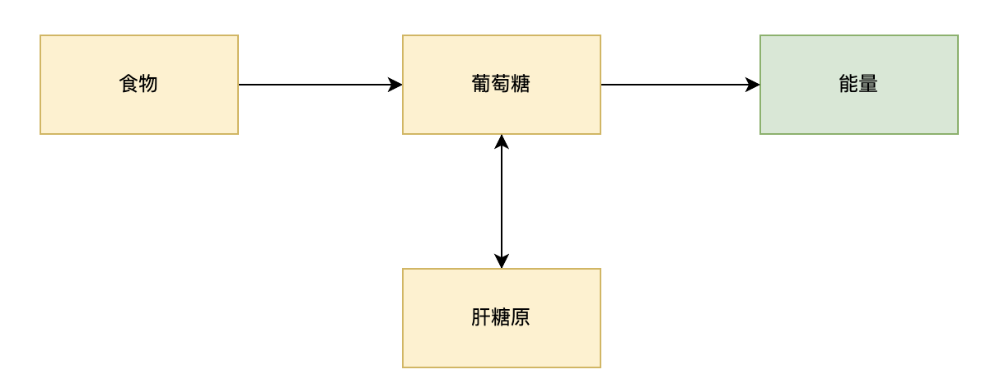
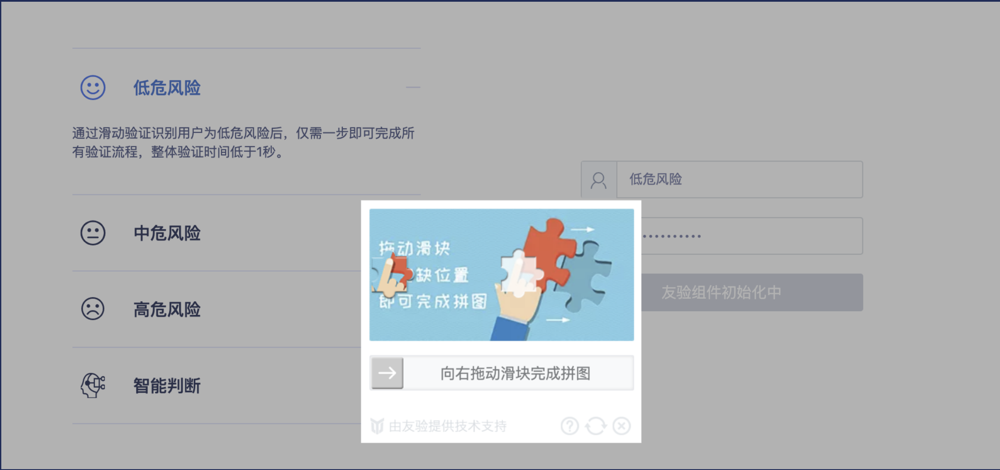
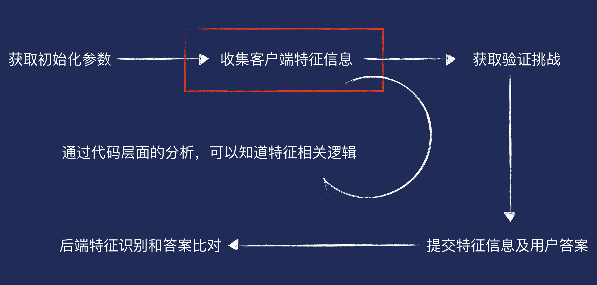

# 大前端环境下的思考

大前端：所谓就是所有前端的统称，比如 Android、iOS、web、Watch 等，最接近用户的那一层也就是UI层，然后将其统一起来，就是大前端。大前端最大的特点在于一次开发，同时适用于所有平台，开发者不用为一个 APP 需要做 Android 和 iOS 两种模式而担心。大前端是 web 统一的时代，利用 web 不仅能开发出网站，更可以开发手机端 web 应用和移动端应用程序。


## 一个简单的问题

问题：我的肚子在咕噜咕噜的叫，怎么办？

解决方案：吃点东西


添加限制条件：由于某些原因，食道受伤了，无法直接进食，这下怎么解决？

解决方案：可能我们可以直接想到到注射一些葡萄糖注射液就能解决


进一步添加限制条件：由于个人的知识存在盲区没法上来就意识到注射葡萄糖注射液这种方案。或者是说目前这种方案还没出，那又怎么办？

由于没有现成的方案，我们只能通过**分析问题，然后思考方案，最后试验并得到最终的解法**。这整个过程是怎样的呢？


问题的分析：

为什么肚子会咕噜咕噜的叫。

机体的能量没有得到及时的补充 => 机体通知大脑 => 大脑发放食欲信号 => 产生饥饿感(感到饥饿，同时肚子咕噜咕噜的叫)

通过前面的原理我们知道，该问题的本质是：**机体需要补充能量**


怎么解决？

通过前面对问题的深刻剖析，我们的要解决的问题变成了：**要如何给机体补充能量** 。那么正常情况下机体是怎么补充能量的呢？

正常情况下机体补充能量的过程：

进食 => 食物经过消化系统消化吸收过转化为葡萄糖 => 葡萄糖进入组织细胞氧化分解，释放出能量以满足人体各项机能的需求。而多余的葡萄糖会合成为肝糖原，储存在肝脏中，当人体内的血糖浓度过低时，肝糖原会分解成人体所需的糖，为人体补充体力。




再结合前面提到的限制条件 **食道受伤了，无法直接进食**，我们可以这么做

1. 直接给胃接条管子，食物通过管子直接到胃，即不通过食道达到进食的目的 
2. 直接注视葡萄糖液，跳过消化系统吸收的环节
3. 补充肝糖原

至于哪种方案效果好，经济实惠，那就弄些小白鼠去试验试验。或者通过以上的分析之后我们再进一步去调查是否已经有相应的现成方案可以使用。这样问题是否就得以解决了？


**小结**

不知通过前面的问题大家是否意识到：当一个问题出现的时候，如果我本身就实践过或者了解过对应问题的解决方案时，问题的解决时一步到位的。但是问题往往没有那么简单，往往由于特定的原因会使得问题变复杂，这时怎么办？**回归原理，基于原理对问题进行分析，并逐步求解**。而通过前面的问题推导，我们不难发现基础原理的重要性。假设我们没有相应的生物基础知识，可能我们只能停留在 “肚子饿了”这么一个问题的表象上，问题也难以有所进展。

同理，在前端的领域，若是一个常规的问题，我已经解决过了或者本身就知道对应的解决方案，可能一步到位就解决了。但也常常会出现由于特定的业务场景使得一个问题变得复杂？这时我们往往需要依托对前端基础知识的深刻理解去对问题进行剖析并逐步找到相应的解决方案。


## 一些团队中存在的问题

1. vue 的模板中的添加事件要不要加 this

```html
<template>
  <div id="app">
    <span @click="onShowBtn">showBtn</span>
    <button @click="this.onClick" v-if="showBtn">button</button>
  </div>
</template>
```

底层原理：最后实现我们页面展示以及逻辑功能的一定是浏览器运行的 html、css、js 代码，那么来看看编译后的代码

```js
var render = function() {
    var _vm = this;
    var _h = _vm.$createElement;
    var _c = _vm._self._c || _h;
    return _c('div', {
        attrs: {
            "id": "app"
        }
    }, [_c('span', {
        on: {
            "click": _vm.onShowBtn
        }
    }, [_vm._v("showBtn")]), (_vm.showBtn) ? _c('button', {
        on: {
            "click": this.onClick
        }
    }, [_vm._v("button")]) : _vm._e()])
}
```

- template 的 html 代码，最终会被转成一个 render 函数
- 是否写 this 的运行结果是一样的
- 如果不写 this，那么在编译的过程中会帮我们自动加上


进一步：

- 既然写和不写的结果是一样的，那为啥要写
- 在模板中写 this ，this 的指向问题本身要怎么做解释（还记得 js 中 this 本身是动态的嘛？是有执行的方式定的嘛？）
  - 对象的方法调用
  - 函数调用
  - apply、call、bind 的方式调用
- eslint、官网文档

​	

2. 为什么没有勇气拍定一个规范？

因为对底层的原理的理解不够深入，连自己都无法确定这到底对不对，如何去说服别人这么做。


## 一些 GMTC 大会的内容

大会分享的内容非常的多，就听到的分享内容来说也还是颇为感概的。感概他们能把一件事做的那么好，整个方案是那么的系统，完善，有理有据。更是感概对一些知识点的深入程度。这里选两个和深入底层、深入基础的内容大概做下简单的介绍。

《[Inside sablejs——打造更快更安全的 JavaScript 实现](https://gmtc.infoq.cn/2021/shenzhen/presentation/3927)》





收集客户特征信息部分：收集客户的特征信息，然后通过加密算法进行加密，生成设备指纹

存在的问题：加密的过程在浏览器上通过 js 代码执行，可以直接被 debug 出来，怎么办？

解决方法：把加密部分放到无法被 debug 的虚拟机中去做（虚拟机保护）


具体怎么做？

WebAssembly 是现成的虚拟机，它本身就会跑在一个独立的虚拟机进程中

现有的方案：WebAssembly + QuickJS

存在的问题：当 WebAssembly 需要一些 DOM 或者 BOM 信息的时候需要和 JavaScript 进行互相调用，调用的方式是通过 eval 进行的，这个调用过程也不安全，一样可以被 debug


解决方案：利用 javascript 去写一个 javascript 的虚拟机

现有的方案：目前已有的javascript 实现的虚拟机性能太差、初始化时间过长

存在的问题：性能太差的话加密算法就没法在虚拟机内部执行，只能放到外部（v8即又变成了在浏览器上执行js代码了）；同时初始化时间太长的话页面性能问题也来了


解决方案：自己写个性能好的 javascript 虚拟机


然后他们就写了 sablejs，后面的内容就讲怎么把性能给优化上来的

编译相关的优化：

1. 函数调用开销及消除
2. 一些编译期优化（计算操作与作用域）
3. 对象属性访问的优化
4. and more...


优化思路均来自各语言 VM 实现：

- Thanks, macro
- Thanks, QuickJS !
- Thanks, PHP !
- Thanks, Lua and Ruby！
- Thanks, V8 !


第一感受：Thanks 没有这样的需求～

思考：如果换了是自己要去解决这样的问题，对相关基础知识的深入和沉淀够了吗？


## 总结：

前端的工作内容是为用户提供一个人机交互的界面。但是为了这个交互过程的体验更好，往往我们要做的不仅仅是将设计师画的界面用代码（html、css、js）实现而已。还要考虑到各种网络的环境（参考弱网优化相关的分享），各种页面性能（参考监控埋点、认证优化的分享），各种无障碍化。此外更要面对雇主所提出的研发效能升级的挑战（各种跨端、低代码、devOps），内容多而纷繁复杂。这或许也就是常说的所谓的大前端，反正只要跟人机交互界面有点相关的都可以往里面塞。身处这样的环境中不免有些疲倦，有些不知所措。那么职业之路究竟该怎么走？

笔者建议是不断的稳固前端相关的基础知识（html、css、javascript、浏览器的原理）、深入理解语言的概念、特性（甚至能了解到代码是如何被解释执行的）；同时不要限制自己，仅仅将自己定位为一位前端开发工程师，而应该将自己定位为一位**软件开发工程师**，只是我们更擅长解决软件问题中与前端相关的问题而已。

东西很多，精力有限，只能排个优先级

1. 学能让自己胜任当前工作的（东西不一定要学的很深，但一定得能让自己胜任当前的工作。时常问问自己遇到问题能不能不求助别人自己解决？不能？那什么时候能做到？）
2. 利用细碎的时间（抽一小部分时间）看看业界的一些方案（不求甚解），当问题出现时说不定能直接想到特定的解决方案（参考最开始直接想到注射葡萄糖注射液的场景）
3. 打基础一定是个人业余时间的主旋律
   1. html、css、javascript 的基础知识
   2. 设计模式、算法、操作系统、编译原理、网络


**最后请记得：当问题变得复杂而现成方案无法解决问题时，只有底层的原理能帮我们理解问题的本质并找到解决问题的方法**。


